# OpenShift Networking

## Physical Node Network Configuration

Configuration begins at the physical, or node level.

Nodes may have a single Network Interface Card or multiple cards bound together for redundancy and greater throughput.

The number of interfaces may have an effect on how physical networks may be accessed to by workloads.

Below are some typical example configurations.

### Node Example: 1 Interface (2 NICs in a bond)

If multiple VLANs are trunked to `bond0`, a VLAN interface would be created at install time for the machine network or the native VLAN can be used if it exists.

An OVS bridge `br-ex` will be attached to this default interface and it will take over the node IP address.

> [!TIP]
> These same examples also apply to a node with a single NIC.

#### Machine Net on Native VLAN

Example with Machine Network on the native VLAN of the trunk feeding bond0.

In the simplest case the node is installed with its IP address directly on the bond0 interface.

```mermaid
graph LR;
    subgraph Cluster[" "]

      subgraph Localnets["Physnet Mappings"]
        physnet-ex[Localnet<br> 🧭 physnet]
      end

      subgraph node1["🖥️ Node "]
        br-ex[ OVS Bridge<br> 🔗 br-ex]
        node1-bond0[bond0 🔌]
      end
    end

    physnet-ex -- maps to --> br-ex
    br-ex --> node1-bond0

    Internet["☁️ "]:::Internet
    node1-bond0 ==(🏷️ 802.1q trunk)==> Internet

    classDef node-eth fill:#37A3A3,color:#00f,stroke:#333,stroke-width:2px

    classDef vlan-default fill:#37A3A3,color:#004d4d,stroke:#333,stroke-width:2px
    class br-ex,physnet-ex,node1-vlan-machine,node1-bond0 vlan-default

    classDef vmdata fill:#9ad8d8,color:#004d4d,stroke:#333,stroke-width:2px
    class node1-vlan1924,br-vmdata,physnet-vmdata vmdata

    classDef labels stroke-width:1px,color:#fff,fill:#005577
    classDef networks fill:#cdd,stroke-width:0px

    style Localnets fill:#fff,stroke:#000,stroke-width:1px
    style Cluster color:#000,fill:#fff,stroke:#333,stroke-width:0px
    style Internet fill:none,stroke-width:0px,font-size:+2em

    classDef nodes fill:#fff,stroke:#000,stroke-width:3px
    class node1,node2,node3 nodes

    classDef node-eth fill:#37A3A3,color:#00f,stroke:#333,stroke-width:2px
    class node1-bond1 node-eth

    classDef nad-1924 fill:#37A3A3,color:#00f,stroke:#333,stroke-width:1px
    class nad-1924-client,nad-1924-ldap,nad-1924-nfs nad-1924
```

#### Machine Net on Tagged  VLAN

Example with Machine Network on a tagged VLAN.

If the machine network is using a VLAN interface then no tags will be visibible on br-ex. A second bridge `br-vmdata` should be attached at `bond0` where all VLAN tags will remain visible.

```mermaid
graph LR;
    subgraph Cluster[" "]

      subgraph Localnets["Physnet Mappings"]
        physnet-ex[Localnet<br> 🧭 physnet]
        physnet-vmdata[Localnet<br> 🧭 physnet-vmdata]
      end

      subgraph node1["🖥️ Node "]
        br-ex[ OVS Bridge<br> 🔗 br-ex]
        br-vmdata[ OVS Bridge<br> 🔗 br-vmdata]
        node1-bond0[bond0 🔌]
        node1-vlan-machine[VLAN Int<br> bond0.123 🔌]
      end
    end

    physnet-ex -- maps to --> br-ex
    physnet-vmdata -- maps to --> br-vmdata
    br-ex --> node1-vlan-machine --> node1-bond0
    br-vmdata --> node1-bond0

    Internet["☁️ "]:::Internet
    node1-bond0 ==(🏷️ 802.1q trunk)==> Internet

    classDef node-eth fill:#37A3A3,color:#00f,stroke:#333,stroke-width:2px

    classDef vlan-default fill:#37A3A3,color:#004d4d,stroke:#333,stroke-width:2px
    class br-ex,physnet-ex,node1-vlan-machine,node1-bond0 vlan-default

    classDef bond1 fill:#9ad8d8,color:#004d4d,stroke:#333,stroke-width:2px
    class br-vmdata,physnet-vmdata bond1


    classDef labels stroke-width:1px,color:#fff,fill:#005577
    classDef networks fill:#cdd,stroke-width:0px

    style Localnets fill:#fff,stroke:#000,stroke-width:1px
    style Cluster color:#000,fill:#fff,stroke:#333,stroke-width:0px
    style Internet fill:none,stroke-width:0px,font-size:+2em

    classDef nodes fill:#fff,stroke:#000,stroke-width:3px
    class node1,node2,node3 nodes

    classDef node-eth fill:#00dddd,color:#00f,stroke:#333,stroke-width:2px
    class node1-bond1 node-eth

    classDef nad-1924 fill:#00ffff,color:#00f,stroke:#333,stroke-width:1px
    class nad-1924-client,nad-1924-ldap,nad-1924-nfs nad-1924
```

### Node Example: 2 Interfaces (4 NICs in 2 bonds)

The first two interfaces are bound into `bond0`. There is only a native VLAN on this bond.
The second two interfaces are bound into `bond1` which recieve multiple VLAN tags from the switch.

```mermaid
graph LR;
    subgraph Cluster[" "]

      subgraph Localnets["Physnet Mappings"]
        physnet-ex[Localnet<br> 🧭 physnet]
        physnet-vmdata[Localnet<br> 🧭 physnet-vmdata]
      end

      subgraph node1["🖥️ Node "]
        br-ex[ OVS Bridge<br> 🔗 br-ex]
        br-vmdata[ OVS Bridge<br> 🔗 br-vmdata]
        node1-bond0[bond0 🔌]
        node1-bond1[bond1 🔌]
      end
    end

    physnet-ex -- maps to --> br-ex
    physnet-vmdata -- maps to --> br-vmdata
    br-ex --> node1-bond0
    br-vmdata --> node1-bond1

    Internet["☁️ "]:::Internet
    node1-bond0 ==default gw==> Internet
    node1-bond1 ==(🏷️ 802.1q trunk)==> Internet

    classDef node-eth fill:#00dddd,color:#00f,stroke:#333,stroke-width:2px

    classDef bond0 fill:#37A3A3,color:#004d4d,stroke:#333,stroke-width:2px
    class br-ex,physnet-ex,node1-bond0 bond0

    classDef bond1 fill:#9ad8d8,color:#004d4d,stroke:#333,stroke-width:2px
    class br-vmdata,physnet-vmdata,node1-bond1 bond1

    classDef labels stroke-width:1px,color:#fff,fill:#005577
    classDef networks fill:#cdd,stroke-width:0px

    style Localnets fill:#fff,stroke:#000,stroke-width:1px
    style Cluster color:#000,fill:#fff,stroke:#333,stroke-width:0px
    style Internet fill:none,stroke-width:0px,font-size:+2em

    classDef nodes fill:#fff,stroke:#000,stroke-width:3px
    class node1,node2,node3 nodes

    classDef nad-1924 fill:#00ffff,color:#00f,stroke:#333,stroke-width:1px
    class nad-1924-client,nad-1924-ldap,nad-1924-nfs nad-1924
```

### Node Example: 3 Interfaces (6 NICs in 3 bonds)

The first two interfaces are bound into `bond0`. There is only a native VLAN on this bond.
The second two interfaces are bound into `bond1` which recieve multiple VLAN tags from the switch.
The last two interfaces are bound into `bond2` which recieve multiple VLAN tags from the switch.

```mermaid
graph LR;
    subgraph Cluster[" "]

      subgraph Localnets["Physnet Mappings"]
        physnet-ex[Localnet<br> 🧭 physnet]
        physnet-vmdata[Localnet<br> 🧭 physnet-vmdata]
      end

      subgraph node1["🖥️ Node "]
        br-ex[ OVS Bridge<br> 🔗 br-ex]
        br-vmdata[ OVS Bridge<br> 🔗 br-vmdata]
        br-linux[ Linux Bridge<br> 🔗 br-linux]
        node1-bond0[bond0 🔌]
        node1-bond1[bond1 🔌]
        node1-bond2[bond2 🔌]
      end
    end

    physnet-ex -- maps to --> br-ex
    physnet-vmdata -- maps to --> br-vmdata
    br-ex --> node1-bond0
    br-vmdata --> node1-bond1
    br-linux --> node1-bond2

    Internet["☁️ "]:::Internet
    node1-bond0 ==default gw==> Internet
    node1-bond1 ==(🏷️ 802.1q trunk)==> Internet
    node1-bond2 ==(🏷️ 802.1q trunk)==> Internet

    classDef node-eth fill:#00dddd,color:#00f,stroke:#333,stroke-width:2px

    classDef vlan-default fill:#37A3A3,color:#004d4d,stroke:#333,stroke-width:2px
    class br-ex,physnet-ex,node1-bond0 vlan-default

    classDef bond1 fill:#9ad8d8,color:#004d4d,stroke:#333,stroke-width:2px
    class br-vmdata,physnet-vmdata,node1-bond1 bond1

    classDef bond2 fill:#daf2f2,color:#004d4d,stroke:#333,stroke-width:2px
    class br-linux,node1-bond2 bond2

    classDef labels stroke-width:1px,color:#fff,fill:#005577
    classDef networks fill:#cdd,stroke-width:0px

    style Localnets fill:#fff,stroke:#000,stroke-width:1px
    style Cluster color:#000,fill:#fff,stroke:#333,stroke-width:0px
    style Internet fill:none,stroke-width:0px,font-size:+2em

    classDef nodes fill:#fff,stroke:#000,stroke-width:3px
    class node1,node2,node3 nodes


    classDef nad-1924 fill:#00ffff,color:#00f,stroke:#333,stroke-width:1px
```

## Logical Network Configuration

Logical networks in OVN Kuberentes may be defined using 3 options for their topology type. Access to a physical VLAN is via a logical network of 'localnet' topology.

Workloads access Ogical networks by way of Network Attachment Definitions. Network attachment definitions are namespace scoped and this enables them to be shared or isolated among tenants.

Network attachment definitions in the 'default' namespace are available for use by workloads in all namespaces.

Accessing VLANs

The `ClusterUserDefinedNetwork` [localnet-1924](../components/localnet-1924/clusteruserdefinednetwork.yaml) references `physicalNetworkName` "physnet-vmdata" which is associated with the bridge "br-vmdata" by [this NNCP](../components/physnet-mapping/nncp.yaml)  which defines an [OVS bridge mapping](https://gist.github.com/dlbewley/9a846ac0ebbdce647af0a8fb2b47f9d0).

```mermaid
graph LR;
    subgraph Cluster[" "]
      udn-localnet-1924["CUDN<br>️ 📄 localnet-1924"]:::udn-localnet-1924
      udn-controller[/"⚙️ UDN Controller"/]

      subgraph Localnets["Physnet Mappings"]
        physnet-vmdata[Localnet<br> 🧭 physnet-vmdata]:::nad-1924;
      end

      subgraph Project["Project Scoped"]
        subgraph ns-nfs["🗄️ **demo-nfs** Namespace"]
          label-nfs("🏷️ vlan-1924"):::labels;
          nad-1924-nfs[NAD<br> 🛜 localnet-1924];
        end

        subgraph ns-ldap["🔎 **demo-ldap** Namespace"]
          label-ldap("🏷️ vlan-1924"):::labels;
          nad-1924-ldap[NAD<br> 🛜 localnet-1924]:::nad-1924;
        end

        subgraph ns-client["💻 **demo-client** Namespace"]
          label-client("🏷️ vlan-1924"):::labels;
          nad-1924-client[NAD<br> 🛜 localnet-1924]:::nad-1924;
        end
      end
      subgraph node1["🖥️ Node "]
        br-vmdata[ OVS Bridge<br> 🔗 br-vmdata]:::vlan-1924;
      end
    end

    udn-localnet-1924 -. selects .-> ns-client
    udn-localnet-1924 -. selects .-> ns-ldap
    udn-localnet-1924 -. selects .-> ns-nfs

    linkStyle 0,1,2 stroke:#007799,stroke-width:2px;

    udn-controller --creates--> nad-1924-nfs
    udn-controller --creates--> nad-1924-ldap
    udn-controller --creates--> nad-1924-client

    linkStyle 3,4,5 stroke:#00dddd,stroke-width:2px;

    udn-controller == implements ==> udn-localnet-1924
    udn-localnet-1924 -. references .-> physnet-vmdata
    physnet-vmdata -- maps to --> br-vmdata

    linkStyle 6,7,8 stroke-width:2px;

    Internet["☁️ "]:::Internet
    br-vmdata ==> Internet

    classDef node-eth fill:#00dddd,color:#00f,stroke:#333,stroke-width:2px;

    classDef bond1 fill:#9ad8d8,color:#004d4d,stroke:#333,stroke-width:2px
    class br-vmdata,physnet-vmdata bond1

    classDef vlan-1924 fill:#00dddd,color:#00f,stroke:#333,stroke-width:2px;
    classDef udn-localnet-1924 fill:#00ffff,color:#00f,stroke:#333,stroke-width:2px;

    classDef labels stroke-width:1px,color:#fff,fill:#005577;
    classDef networks fill:#cdd,stroke-width:0px;

    style udn-controller fill:#fff,stroke:#000,stroke-width:1px;
    style node1 fill:#fff,stroke:#000,stroke-width:3px;
    style Localnets fill:#fff,stroke:#000,stroke-width:1px;
    style Cluster color:#000,fill:#fff,stroke:#333,stroke-width:0px;
    style Project color:#000,fill:#dff,stroke:#333,stroke-width:0px
    style Internet fill:none,stroke-width:0px,font-size:+2em;

    classDef nodes stroke-width:3px;
    class node1,node2,node3 nodes;
    classDef namespace color:#000,fill:#fff,stroke:#000,stroke-width:2px;
    class ns-nfs,ns-client,ns-ldap namespace;

    classDef nad-1924 fill:#00ffff,color:#00f,stroke:#333,stroke-width:1px;
    class nad-1924-client,nad-1924-ldap,nad-1924-nfs nad-1924;
```

## VM Connectivity

The UDN Controller will ensure that any namespace identified by the CUDN selector has a `NetworkAttachmentDefinition` created within it. This NAD will be used to create a port on the vswitch for the virtual machine NICs to attach to.

```mermaid
graph LR;
    subgraph Cluster[" "]

      subgraph Project[" "]
        subgraph ns-nfs["🗄️ **demo-nfs** Namespace"]
          label-nfs("🏷️ vlan-1924")
          nad-1924-nfs[NAD<br> 🛜 localnet-1924]
          subgraph vm-nfs["🗄️ NFS Server"]
              nfs-eth0[eth0 🔌]
          end
        end

        subgraph ns-ldap["🔎 **demo-ldap** Namespace"]
          label-ldap("🏷️ vlan-1924")
          nad-1924-ldap[NAD<br> 🛜 localnet-1924]
          subgraph vm-ldap["🔎 LDAP Server"]
              ldap-eth0[eth0 🔌]
          end
        end

        subgraph ns-client["💻 **demo-client** Namespace"]
          label-client("🏷️ vlan-1924")
          nad-1924-client[NAD<br> 🛜 localnet-1924]
          subgraph vm-client["💻 Client"]
              client-eth0[eth0 🔌]
          end
        end

      end

      subgraph node1["🖥️ Node "]
        br-vmdata[ OVS Bridge<br> 🔗 br-vmdata]:::vlan-1924;
      end
    end

    nfs-eth0    ---> nad-1924-nfs
    ldap-eth0   ---> nad-1924-ldap
    client-eth0 ---> nad-1924-client


    nad-1924-client --> br-vmdata
    nad-1924-ldap --> br-vmdata
    nad-1924-nfs --> br-vmdata


    linkStyle 0,1,2,3,4,5 stroke:#00dddd,stroke-width:2px;

    Internet["☁️ "]:::Internet
    br-vmdata ==> Internet


    classDef node-eth fill:#00dddd,color:#00f,stroke:#333,stroke-width:2px;
    class node1-eth0 node-eth;

    classDef vm-eth fill:#00ffff,color:#00f,stroke:#444,stroke-width:1px;
    class client-eth0,ldap-eth0,nfs-eth0 vm-eth;

    classDef vlan-1924 fill:#00dddd,color:#00f,stroke:#333,stroke-width:2px;

    classDef labels stroke-width:1px,color:#fff,fill:#005577;
    class label-client,label-ldap,label-nfs labels;

    style Cluster color:#000,fill:#fff,stroke:#333,stroke-width:0px;
    style Project color:#000,fill:#dff,stroke:#333,stroke-width:0px;
    style Internet fill:none,stroke-width:0px,font-size:+2em;

    classDef vm color:#000,fill:#eee,stroke:#000,stroke-width:2px
    class vm-client,vm-ldap,vm-nfs vm

    classDef nodes fill:#fff,stroke:#000,stroke-width:3px;
    class node1 nodes;

    classDef namespace color:#000,fill:#fff,stroke:#000,stroke-width:2px;
    class ns-nfs,ns-client,ns-ldap namespace;

    classDef nad-1924 fill:#00ffff,color:#00f,stroke:#333,stroke-width:1px;
    class nad-1924-client,nad-1924-ldap,nad-1924-nfs nad-1924;
```

### VLAN Guest Tagging

Trunking 802.1Q to virtual machines, commonly known as VGT, is not yet supported by OVN and requires Linux Bridge on a dedicate host interface.

```mermaid
graph LR;
    subgraph Cluster[" "]

      subgraph Localnets["Physnet Mappings"]
        physnet-ex[Localnet<br> 🧭 physnet]
        physnet-vmdata[Localnet<br> 🧭 physnet-vmdata]
      end
        subgraph ns-client[" Firewall Namespace"]
          nad-vgt-client[NAD<br> 🛜 trunk]
          subgraph vm-client["🔥 Firewall"]
              vgt-client-eth0[eth0 🔌]
          end
        end

      subgraph node1["🖥️ Node "]
        br-ex[ OVS Bridge<br> 🔗 br-ex]
        br-vmdata[ OVS Bridge<br> 🔗 br-vmdata]
        br-linux[ Linux Bridge<br> 🔗 br-linux]
        node1-bond0[bond0 🔌]
        node1-bond1[bond1 🔌]
        node1-bond2[bond2 🔌]
      end
    end

    physnet-ex -- maps to --> br-ex
    physnet-vmdata -- maps to --> br-vmdata
    br-ex --> node1-bond0
    br-vmdata --> node1-bond1
    br-linux --> node1-bond2
    vgt-client-eth0 <==(🏷️ 802.1q trunk)==> br-linux
    vgt-client-eth0 -.-> nad-vgt-client
    nad-vgt-client -.->  br-linux

    Internet["☁️ "]:::Internet
    node1-bond0 ==default gw==> Internet
    node1-bond1 ==(🏷️ 802.1q trunk)==> Internet
    node1-bond2 ==(🏷️ 802.1q trunk)==> Internet

    classDef node-eth fill:#00dddd,color:#00f,stroke:#333,stroke-width:2px

    classDef vlan-default fill:#00aadd,color:#00f,stroke:#333,stroke-width:2px
    class br-ex,physnet-ex,node1-bond0 vlan-default

    classDef vlan-1924 fill:#00dddd,color:#00f,stroke:#333,stroke-width:2px
    class br-vmdata,physnet-vmdata vlan-1924

    classDef labels stroke-width:1px,color:#fff,fill:#005577
    classDef networks fill:#cdd,stroke-width:0px

    style Localnets fill:#fff,stroke:#000,stroke-width:1px
    style Cluster color:#000,fill:#fff,stroke:#333,stroke-width:0px
    style Internet fill:none,stroke-width:0px,font-size:+2em

    classDef nodes fill:#fff,stroke:#000,stroke-width:3px
    class node1,node2,node3 nodes

    classDef node-eth fill:#00dddd,color:#00f,stroke:#333,stroke-width:2px
    class node1-bond1 node-eth

    classDef nad-vgt fill:#00ffff,color:#00f,stroke:#333,stroke-width:1px
    class nad-vgt-client,vgt-client-eth0,node1-bond2,br-linux nad-vgt

    classDef vm color:#000,fill:#eee,stroke:#000,stroke-width:2px
    class vm-client,vm-ldap,vm-nfs vm

    classDef namespace color:#000,fill:#fff,stroke:#000,stroke-width:2px;
    class ns-nfs,ns-client,ns-ldap namespace;
```

