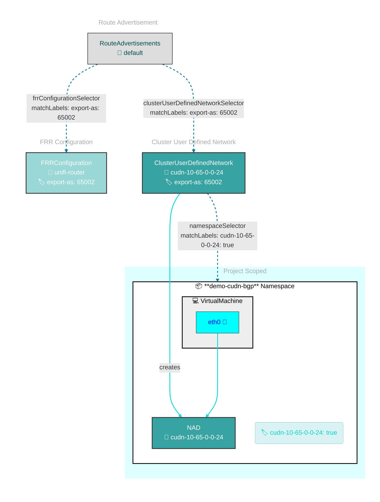
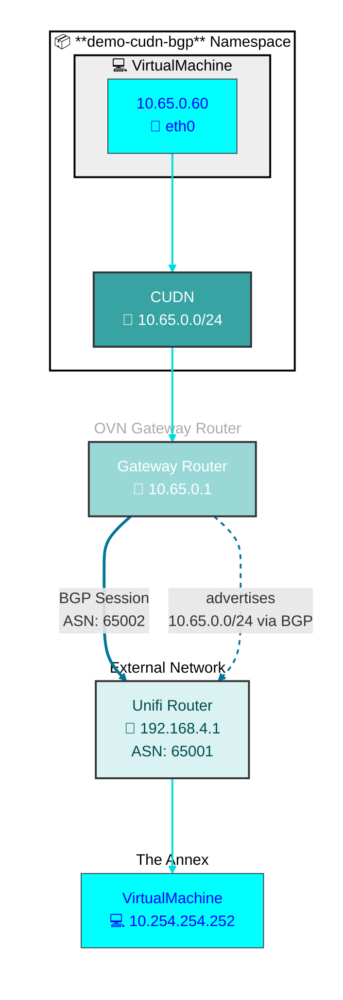

# BGP Route Advertisement with FRR

This directory contains Kubernetes manifests for demonstrating BGP route advertisement from ClusterUserDefinedNetworks to external routers using FRR (Free Range Routing).

## Overview

This demo demonstrates how to:
- Configure BGP peering between the cluster and an external router using FRR
- Advertise ClusterUserDefinedNetwork routes via BGP
- Use static IP addressing for VirtualMachines with route advertisement
- Set up RouteAdvertisements to control which networks are advertised

## Components

### ClusterUserDefinedNetwork

The `clusteruserdefinednetwork.yaml` defines a CUDN named `cluster-udn-001` with:
- **Topology**: Layer2
- **Role**: Primary
- **Subnet**: `10.65.0.0/24`
- **IPAM Lifecycle**: Persistent
- **Label**: `advertise: "true"` (used by RouteAdvertisements to select this network)
- **Namespace Selector**: Creates NetworkAttachmentDefinition in namespaces with label `export-as: "65002"`

### FRRConfiguration

The `frrconfiguration.yaml` configures BGP peering:
- **BGP ASN**: 65002 (cluster side)
- **Neighbor**: 192.168.4.1 (external router)
- **Neighbor ASN**: 65001
- **Advertisement Mode**: All (advertises all allowed routes)
- **Label**: `advertise: "true"` (used by RouteAdvertisements to select this FRR config)
- **Namespace**: `openshift-frr-k8s` (FRR operator namespace)

### RouteAdvertisements

The `routeradvertisements.yaml` configures which networks to advertise:
- **PodNetwork**: Advertises pod network routes
- **CUDN Selector**: Selects CUDNs with label `advertise: "true"`
- **FRR Config Selector**: Uses FRRConfiguration with label `advertise: "true"`
- **Node Selector**: Empty (applies to all nodes)

**Note**: This resource is available in OpenShift 4.21+.

### VirtualMachine

The `virtualmachine.yaml` defines a Fedora VM with:
- **Static IP**: `10.60.0.60` (configured via annotation `network.kubevirt.io/addresses`)
- **Interface**: Uses l2bridge binding to connect to the Primary UDN
- **Namespace**: `demo-cudn-bgp` (matches the CUDN namespace selector)

**Note**: Static IP addressing via annotation requires OpenShift 4.21+.

### Namespace

The `namespace.yaml` creates the `demo-cudn-bgp` namespace with:
- **Label**: `export-as: "65002"` (matches CUDN namespace selector)
- **Label**: `k8s.ovn.org/primary-user-defined-network: ""` (required for Primary UDN)

## Prereqs

- Enable routing

```bash
oc patch network.operator cluster --type merge --patch \
'{
   "spec":{
      "additionalRoutingCapabilities":{
         "providers":[ "FRR" ]
      },
      "defaultNetwork":{
         "ovnKubernetesConfig":{
            "routeAdvertisements":"Enabled"
         }
      }
   }
}'
```

- Optional for use cases I'm not familiar with yet

```bash
oc patch network.operator cluster --type merge --patch \
	'{
	  "spec": {
	    "defaultNetwork": {
	      "ovnKubernetesConfig": {
			"gatewayConfig": {
		        "routingViaHost": true
			}
	      }
	    }
	  }
	}'
```

## Peer Router

Using a Unifi UDM Pro and [this configuration](unifi-frr.conf).

## Deployment

Apply the kustomization:

```bash
kubectl apply -k demo/bgp
```

## Network Flow

1. **CUDN Creation**: The ClusterUserDefinedNetwork creates a Primary UDN in the namespace
2. **VM Static IP**: The VM receives the static IP `10.65.0.60` from the `10.65.0.0/24` subnet
3. **Route Advertisement**: RouteAdvertisements selects the CUDN (via `advertise: "true"` label) and the FRRConfiguration
4. **BGP Peering**: FRR establishes BGP session with external router at `192.168.4.1`
5. **Route Propagation**: The `10.65.0.0/24` route is advertised to the external router via BGP

## Configuration

### BGP Peering

Update the FRRConfiguration to match your environment:
- **Neighbor Address**: Change `192.168.4.1` to your external router IP
- **ASN**: Update ASNs (65001/65002) to match your BGP configuration
- **Advertisement Mode**: Adjust `toAdvertise.allowed.mode` if you need more granular control

### Static IP Assignment

The VM uses static IP via annotation:
```yaml
annotations:
  network.kubevirt.io/addresses: '{"eth0": ["10.65.0.60"]}'
```

Change the IP address in the annotation to assign a different static IP from the subnet.

### Network Selection

To advertise additional networks:
1. Add `advertise: "true"` label to the CUDN
2. The RouteAdvertisements resource will automatically select it

To exclude a network from advertisement:
1. Remove or change the `advertise` label on the CUDN

## Prerequisites

- OpenShift 4.21+ (for RouteAdvertisements and static IP annotations)
- FRR operator installed in `openshift-frr-k8s` namespace
- External BGP router configured to peer with the cluster
- Physical networking configured (if using localnet CUDNs)

## Verification

1. **Check FRRConfiguration**:
   ```bash
   kubectl get frrconfiguration -n openshift-frr-k8s
   ```

2. **Check RouteAdvertisements**:
   ```bash
   kubectl get routeadvertisements
   ```

3. **Verify BGP Session**:
   ```bash
   kubectl exec -n openshift-frr-k8s <frr-pod> -- vtysh -c "show bgp summary"
   ```

4. **Check Advertised Routes**:
   ```bash
   kubectl exec -n openshift-frr-k8s <frr-pod> -- vtysh -c "show bgp neighbors <neighbor-ip> advertised-routes"
   ```

5. **Verify VM IP**:
   ```bash
   kubectl get vm fedora-static-cudn-01 -n demo-cudn-bgp -o yaml | grep addresses
   ```
### OVN

Logical router for a CUDN is named as follows:
- `GR_cluster_udn_<CUDN name with - translated to .>_${NODE_NAME}`

```bash
$ ovncli hub-4k77l-cnv-2xb92
sh-5.1# ovn-nbctl lr-list
b333c98c-6824-415d-b087-34fe8b68d859 (GR_cluster_udn_cudn.10.65.0.0.24_hub-4k77l-cnv-2xb92)
7669b79e-3eb6-48dc-b5cc-101ef2fce78f (GR_demo.vm.primary.udn_primary.udn_hub-4k77l-cnv-2xb92)
6554184f-d625-4b8a-b5bb-5b4c3a299d8f (GR_hub-4k77l-cnv-2xb92)
50e3d199-bccf-4ea9-a877-88fdbf1c3798 (ovn_cluster_router)

sh-5.1# ovn-nbctl lr-route-list GR_cluster_udn_cudn.10.65.0.0.24_hub-4k77l-cnv-2xb92
IPv4 Routes
Route Table <main>:
             10.65.0.0/24                 10.65.0.2 src-ip
           169.254.0.0/17               169.254.0.4 dst-ip rtoe-GR_cluster_udn_cudn.10.65.0.0.24_hub-4k77l-cnv-2xb92
                0.0.0.0/0               192.168.4.1 dst-ip rtoe-GR_cluster_udn_cudn.10.65.0.0.24_hub-4k77l-cnv-2xb92
```

## Notes

- The CUDN uses Primary role, making it the default route for pods in the namespace
- Static IP addressing requires the `network.kubevirt.io/addresses` annotation (4.21+)
- RouteAdvertisements is a cluster-scoped resource that controls BGP route advertisement
- FRRConfiguration must be in the `openshift-frr-k8s` namespace
- Ensure the external router is configured to accept BGP peering from the cluster

## Demo



### Network Flow


