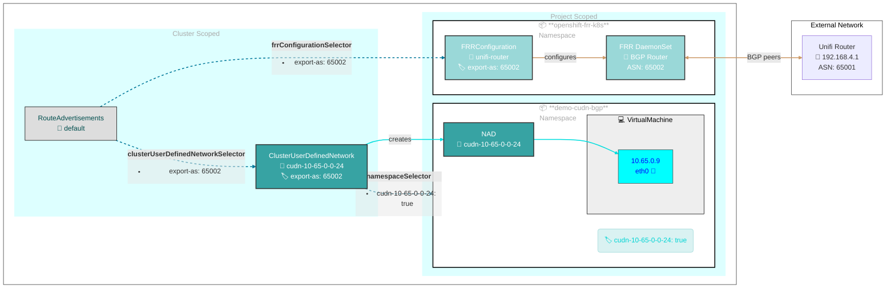
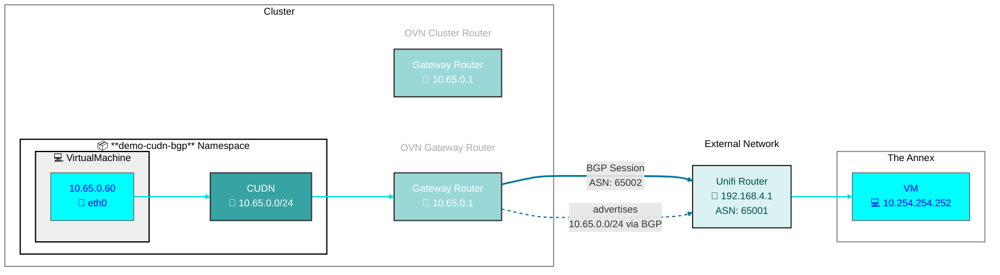

# BGP Route Advertisement with FRR

This directory contains Kubernetes manifests for demonstrating BGP route advertisement from ClusterUserDefinedNetworks to external routers using FRR-K8s (Free Range Routing Kubernetes) on OpenShift.

## Overview

This demo demonstrates how to:
- Configure BGP peering between the cluster and an external router using FRR
- Advertise ClusterUserDefinedNetwork routes via BGP
- Set up RouteAdvertisements to control which networks are advertised

## Components

### ClusterUserDefinedNetwork

The [clusteruserdefinednetwork.yaml](clusteruserdefinednetwork.yaml) defines a CUDN named `cudn-10-65-0-0-24` with:
- **Topology**: Layer2
- **Role**: Primary
- **Subnet**: `10.65.0.0/24`
- **IPAM Lifecycle**: Persistent
- **Label**: `export-as: "65002"` (used by RouteAdvertisements to select this network)
- **Namespace Selector**: Creates a `NetworkAttachmentDefinition` in namespaces with label `cudn-10-65-0-0-24: "true"`

### FRRConfiguration

The [frrconfiguration.yaml](frrconfiguration.yaml) configures BGP peering:
- **BGP ASN**: 65002 (cluster side)
- **Neighbor**: 192.168.4.1 (external router)
- **Neighbor ASN**: 65001 (peer side)
- **Advertisement Mode**: All (advertises all allowed routes)
- **Label**: `export-as: "65002"` (used by `RouteAdvertisements` to select this FRR config)
- **Namespace**: `openshift-frr-k8s` (FRR operator namespace)

### RouteAdvertisements

The [routeadvertisements.yaml](routeadvertisements.yaml) configures which networks to advertise:
- **PodNetwork**: Advertises pod network(s) routes
- **CUDN Selector**: Selects CUDNs with label `export-as: "65002"`
- **FRR Config Selector**: Uses FRRConfiguration with label `export-as: "65002"`
- **Node Selector**: Empty (applies to all nodes)

### VirtualMachine

The [virtualmachine.yaml](virtualmachine.yaml) defines a VM with:
- **Interface**: Uses `l2bridge` binding to connect to the namespace Primary CUDN when patched by [kustomize](kustomization.yaml)
- **Namespace**: `demo-cudn-bgp` (matches the CUDN namespace selector)

### Namespace

The [namespace.yaml](namespace.yaml) creates the `demo-cudn-bgp` namespace with:
- **Label**: `cudn-10-65-0-0-24: "true"` (matches CUDN namespace selector)
- **Label**: `k8s.ovn.org/primary-user-defined-network: ""` (required for Primary UDN)

## Prerequisites for using BGP with OVN-Kubernetes

- Enable routing with FRR-K8s

```bash
oc patch network.operator cluster --type merge --patch \
'{
   "spec":{
      "additionalRoutingCapabilities":{
         "providers":[ "FRR" ]
      },
      "defaultNetwork":{
         "ovnKubernetesConfig":{
            "routeAdvertisements":"Enabled"
         }
      }
   }
}'
```

- Optional for use cases including VRF-lite and locally connected routes

```bash
oc patch network.operator cluster --type merge --patch \
    '{
      "spec": {
        "defaultNetwork": {
          "ovnKubernetesConfig": {
            "gatewayConfig": {
                "routingViaHost": true
            }
          }
        }
      }
    }'
```

## Deployment

Apply the kustomization:

```bash
kubectl apply -k demo/bgp
```

## Configuration

### BGP Peering

Update the [FRRConfiguration](frrconfiguration.yaml) to match your environment:
- **Neighbor Address**: Change `192.168.4.1` to your external router IP
- **ASN**: Update ASNs (65001/65002) to match your BGP configuration
- **Advertisement Mode**: Adjust `toAdvertise.allowed.mode` if you need more granular control

### Network Selection

To advertise additional networks:
1. Add `export-as: "65002"` label to the CUDN
2. The RouteAdvertisements resource will automatically select it

To exclude a network from advertisement:
1. Remove or change the label on the CUDN

## Verification

1. **Check FRRConfiguration**:
   ```bash
   kubectl get frrconfiguration -n openshift-frr-k8s
   ```

2. **Check RouteAdvertisements**:
   ```bash
   kubectl get routeadvertisements
   ```

3. **Verify BGP Session**:
   ```bash
   kubectl exec -n openshift-frr-k8s <frr-pod> -- vtysh -c "show bgp summary"
   ```

4. **Check Advertised Routes**:
   ```bash
   kubectl exec -n openshift-frr-k8s <frr-pod> -- vtysh -c "show bgp neighbors <neighbor-ip> advertised-routes"
   ```

5. **Verify VM IP**:
   ```bash
   kubectl get vm fedora-static-cudn-01 -n demo-cudn-bgp -o yaml | grep addresses
   ```

### OVN

Logical router for a CUDN is named as follows:
- `GR_cluster_udn_<CUDN name with - translated to .>_${NODE_NAME}`

```bash
$ ovncli hub-4k77l-cnv-2xb92
sh-5.1# ovn-nbctl lr-list
b333c98c-6824-415d-b087-34fe8b68d859 (GR_cluster_udn_cudn.10.65.0.0.24_hub-4k77l-cnv-2xb92)
7669b79e-3eb6-48dc-b5cc-101ef2fce78f (GR_demo.vm.primary.udn_primary.udn_hub-4k77l-cnv-2xb92)
6554184f-d625-4b8a-b5bb-5b4c3a299d8f (GR_hub-4k77l-cnv-2xb92)
50e3d199-bccf-4ea9-a877-88fdbf1c3798 (ovn_cluster_router)

sh-5.1# ovn-nbctl lr-route-list GR_cluster_udn_cudn.10.65.0.0.24_hub-4k77l-cnv-2xb92
IPv4 Routes
Route Table <main>:
             10.65.0.0/24                 10.65.0.2 src-ip
           169.254.0.0/17               169.254.0.4 dst-ip rtoe-GR_cluster_udn_cudn.10.65.0.0.24_hub-4k77l-cnv-2xb92
                0.0.0.0/0               192.168.4.1 dst-ip rtoe-GR_cluster_udn_cudn.10.65.0.0.24_hub-4k77l-cnv-2xb92
```

## Notes

- The CUDN uses Primary role, making it the default route for pods in the namespace
- RouteAdvertisements is a cluster-scoped resource that controls BGP route advertisement
- FRRConfiguration must be in the `openshift-frr-k8s` namespace
- Ensure the external router is configured to accept BGP peering from the cluster

## Demo
### Deployment Flow

1. **Namespace Creation**: The Namespace _demo-cudn-bgp_ is created with label in place allowing for replacement of primary network
1. **CUDN Creation**: The `ClusterUserDefinedNetwork` _cudn-10-65-0-0-24_ creates a Primary UDN NAD in the namespace with subnet `10.65.0.0/24`
1. **Route Advertisement**: A `RouteAdvertisements` is created which selects the CUDN (via `export-as: "65002"` label) and the `FRRConfiguration` (via `export-as: "65002"` label)
1. **FRR Configuration**: Selected `FRRConfiguration` resources are interpolated to generated a FRRConfiguration for each node and applied via `DaemonSet`.
1. **BGP Peering**: FRR using above configuration establishes a BGP session with external router at `192.168.4.1` using
1. **Route Propagation**: The `10.65.0.0/24` route is advertised to the external router via BGP
1. **CUDN Ingress**: Clients on other side of peer router may now reach 10.65.0.0/24 directly, provided a return route is also known to the VRF.



### Network Flow
> [!WARNING]
> **Ignore, WIP**

